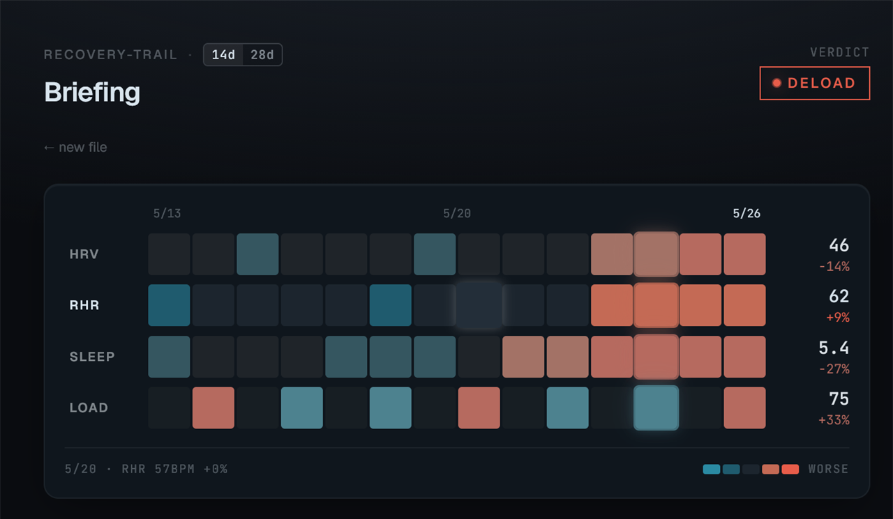
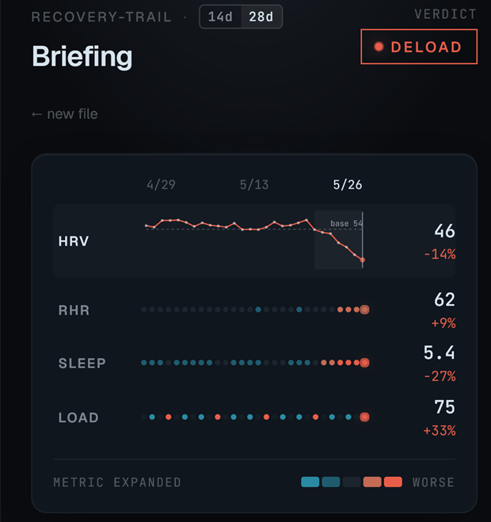
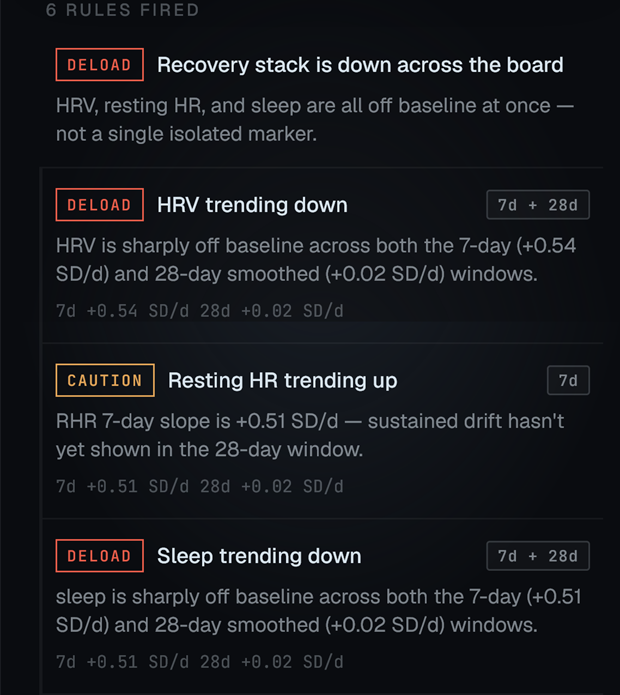

# recovery-trail

**A two-week briefing on whether to push or pull back, with the math
shown.** Drop an Apple Health `export.xml` in your browser, get an
ACSM-aligned training verdict driven by dual-window trend detection.
No backend, no upload, no account — parsing and reasoning both happen
client-side.

🔗 **Live:** [conalh.github.io/recovery-trail](https://conalh.github.io/recovery-trail/) — there's a "Try with sample data" button on the import screen.

<p align="center">
  
</p>

---

## What you see

The briefing view is a single page, mobile-first:

- **Top strip** — app name, a `[14d] [28d]` window toggle, and the
  verdict pill (`standard` / `caution` / `deload`). The verdict dot
  glows in its severity color and pulses three times on first load
  when you're in deload territory.
- **Heatmap card** — four rows (HRV, RHR, Sleep, Load) × N daily
  cells. Each cell is colored on a 5-tier scale by how far that day
  deviates from the metric's 28-day baseline (teal = better than
  baseline, rust = worse). The today cell carries an ambient breath
  pulse.
- **Narrative line** — auto-generated from the data: *"Through 5/18
  everything was at baseline. Then three metrics rolled over at once
  — and stayed there."* The cleanest day-in-window is detected from
  the rule firings.
- **Rules fired** — flat list of every rule that triggered, with an
  inline `7d` / `28d` / `7d + 28d` badge on trend rules so you can
  see which detector(s) fired before the engine v2 combiner resolved
  the severity. Evidence line shows the raw slope numbers in SD/day.

When ≥3 rules fire across ≥3 metrics, a synthesized **meta-rule**
("Recovery stack is down across the board") gets prepended to frame
the situation rather than recite numbers.

<p align="center">
  
  
</p>

## How the reasoning works — engine v2

Each recovery signal (HRV / RHR / sleep) runs two slope estimators
side by side, ported from
[fit-ontology](https://github.com/Conalh/fit-ontology):

- **Acute**: 7-day ordinary least-squares slope of the raw daily
  series, normalized by the 28-day baseline SD so thresholds live in
  SD/day. Responsive but noisy.
- **Chronic**: 28-day EWMA (halflife 10 days, pandas-style adjusted)
  followed by OLS on the smoothed series. Damps short-window noise
  so the slope reflects sustained drift.

A combiner resolves the pair per the engine v2 decision table:

- **Acute-only fires** → demote one band (noise suppression — the
  headline rule from Plews, Laursen et al. 2013, who recommend
  ~4-week windows for individual-level monitoring exactly because
  the 7-day variance is too high to act on alone).
- **Chronic stronger than acute** → promote one band (chronic is
  seeing what the acute window hasn't caught yet).
- **Chronic confirms acute at same or lower tier** → trust the
  acute band.

A second safety rule fires when the composite recovery score is ≥
90: trend signals get demoted one more band, on the basis that
excellent levels shouldn't be overridden by borderline trend math.
Level signals (HRV-below-baseline, RHR-above-baseline,
sleep-deficit, ACWR) run alongside the trend signals — levels see
*where* the metric is, trends see *where it's going*.

Thresholds and math live in [`src/rules/trend.ts`](src/rules/trend.ts).

## Interactions

- **Tap a cell** → day inspector slides in below the heatmap, all
  four metrics' value/baseline/delta for that day.
- **Tap a metric label** (HRV/RHR/SLEEP/LOAD) → that row's cells
  swap for a real line chart with baseline overlay, 7-day window
  shading, and clickable dots.
- **Tap a rule** → focus mode. The relevant metric row stays bright,
  others dim + desaturate. Meta-rule keeps all rows bright (it's a
  stack-wide rule, not metric-bound).
- **Tap `28d`** → heatmap and chart expand to engine v2's full
  baseline window. The acute 7-day strip stays highlighted inside
  the chronic 28-day window.
- **Keyboard**
  - `← →` step the selected day through the window (opens the
    inspector implicitly)
  - `Esc` closes whatever's open in priority order: inspector →
    expanded metric → focused rule
  - `1` `2` `3` `4` toggle HRV/RHR/SLEEP/LOAD expansion
- **Hover** anywhere on the heatmap or chart → hint line under the
  legend reads `5/18 · HRV 51ms -3%` while you scrub.

## Try it

### Live (no install)

[conalh.github.io/recovery-trail](https://conalh.github.io/recovery-trail/) → click **Try with sample data**.

### With your own export

1. iPhone → Health app → tap your profile photo (top right) →
   "Export All Health Data" → AirDrop or email the zip to your
   computer.
2. Unzip — find `export.xml` (the file is typically 50–500 MB).
3. Drop it on the page. A web worker streams the parse without
   blocking the UI; an HRV/RHR/sleep dataset usually comes back in
   a few seconds.

The file never leaves your browser. Parsing is purely client-side.

## Stack

- Vite + React 19 + TypeScript
- Tailwind v3 (with custom `@layer utilities` for glow / pulse /
  stagger animations to compose against Tailwind's box-shadow
  CSS-variable system)
- Geist (sans) + JetBrains Mono via Google Fonts
- Single web worker for streaming Apple Health XML — handles
  multi-hundred-MB exports without blocking the UI
- Zero charting deps — sparklines and the in-row metric chart are
  hand-rolled SVG
- Zero analytics, zero tracking

## Develop

```bash
npm install
npm run dev            # http://localhost:5173
npm run build          # outputs ./dist with /recovery-trail/ base for Pages
npm run preview        # serve the built bundle
```

The GitHub Pages deploy is fully automated via
[`.github/workflows/deploy.yml`](.github/workflows/deploy.yml) —
every push to `main` builds and ships. Workflow uses the Node 24
versions (`checkout@v6`, `setup-node@v6`, `configure-pages@v6`,
`upload-pages-artifact@v5`, `deploy-pages@v5`).

## Project layout

```text
src/
  lib/                              Apple Health XML parser + worker
    appleHealth.ts                  main-thread wrapper
    appleHealth.worker.ts           streaming XML parser
    sample.ts                       synthetic export for the demo
    types.ts                        parsed-export schema

  rules/                            reasoning layer
    trend.ts                        engine v2 — OLS, EWMA, slope severity,
                                    combineAcuteChronic, demoteOneBand,
                                    compositeRecoveryScore, detectTrend
    evaluate.ts                     wires trend detectors + level signals
                                    + ACWR + meta-rule into a Recommendation
    aggregate.ts                    daily aggregation helpers
    briefing.ts                     cell-tier, narrative, metaRule
    thresholds.json                 tunable ACSM/engine-v2 constants

  components/                       briefing UI
    Dashboard.tsx                   thin wrapper over HeatmapBriefing
    HeatmapBriefing.tsx             top strip, heatmap, rules list,
                                    keyboard nav, focus / hover state
    MetricChart.tsx                 in-row SVG line chart
    DayInspector.tsx                slide-in card showing one day's
                                    metrics
    ImportZone.tsx                  drag-drop file picker
    ParseProgress.tsx               progress UI for big exports
    Sparkline.tsx                   tiny SVG sparkline

  App.tsx                           import-flow state machine
                                    (idle / parsing / ready / error)
  index.css                         Tailwind + animation keyframes

design/                             Claude Design exports + screenshots
.github/workflows/deploy.yml        GitHub Pages deploy
```

## Disclaimer

recovery-trail is an exploratory tool for fit, generally-healthy
adults already training. It is **not** medical advice. ACSM
thresholds, slope-severity bands, and the engine v2 combiner are
general guidance derived from published methodology, not personal
prescription. Talk to a clinician for anything that matters.

## Credits

Trend-detection methodology and reasoning layer ported from
[fit-ontology](https://github.com/Conalh/fit-ontology) — the
trainer-facing companion. Methodology references:

- Plews, Laursen, Stanley, Kilding, Buchheit (2013), *Sports Med*
  43(9):773–781 — *Training Adaptation and Heart Rate Variability
  in Elite Endurance Athletes.*
- Buchheit (2014) — *Monitoring training status with HR measures.*
- Gabbett (2016) — acute:chronic workload ratio.
- ACSM's *Guidelines for Exercise Testing and Prescription*, 11e.

## License

MIT.
